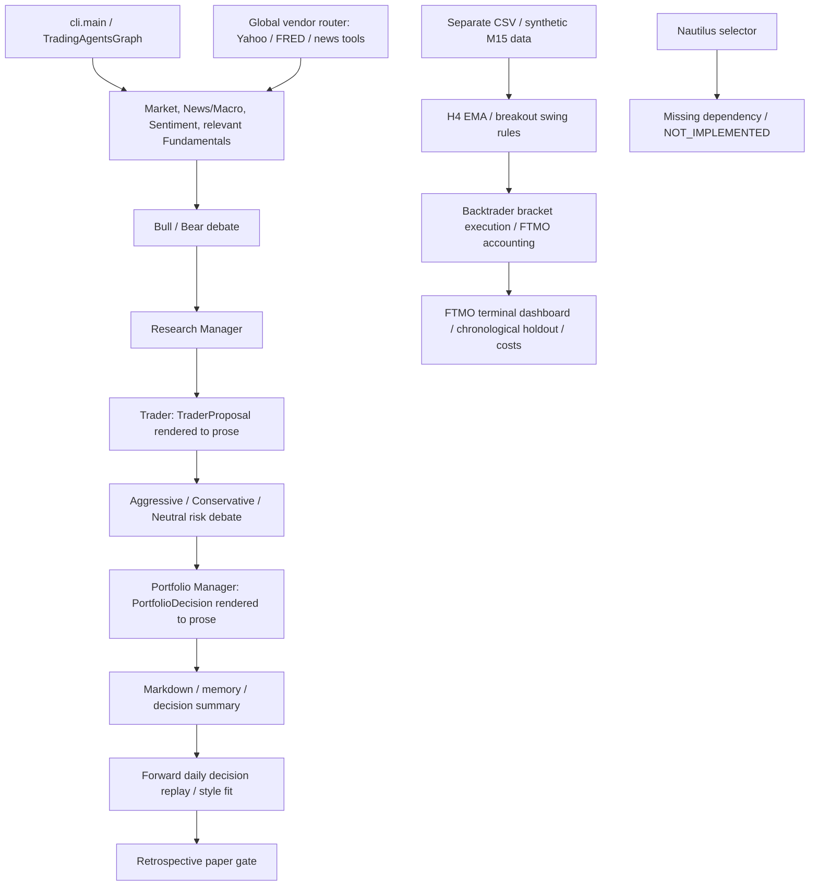
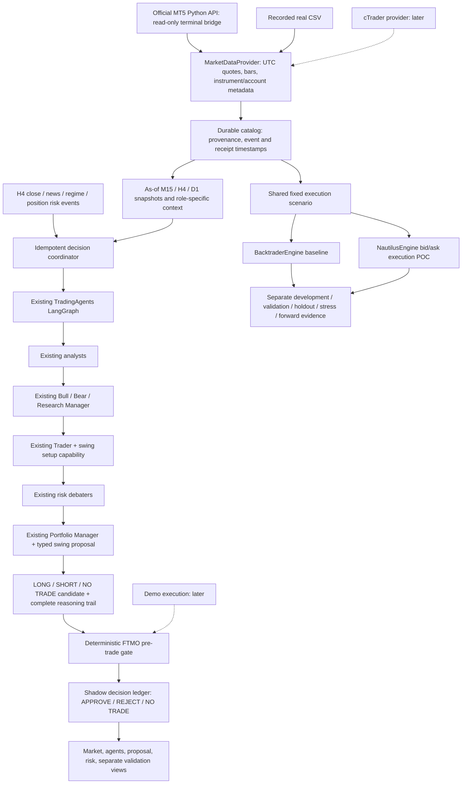

# Astra Integration Architecture

Date: 2026-09-12. The user's **Astra prompt - Integrate TradingAgents, Nautilus and
live FTMO market data** roadmap is authoritative. Its unchanged local copy is
[ASTRA_ROADMAP_SOURCE.md](ASTRA_ROADMAP_SOURCE.md); this document maps that roadmap
onto this fork and records implementation decisions, not a replacement direction.

## Current Architecture

The actual LangGraph edges live in `tradingagents/graph/setup.py`, not in the FTMO
module. All three risk debaters, both researchers, the Research Manager, Trader
and Portfolio Manager exist. Fundamentals are optional in the existing analyst
selection and are inappropriate as company-accounting analysis for spot EUR/USD.

## Proposed Architecture

Recording is a separate process from LLM reasoning: a slow LLM request must never
stop quote persistence or risk observation. Shadow mode has no order transport.
An APPROVE result means the deterministic gate allowed a *shadow proposal*, not
that a live order was placed, or that profitability has been established.

## Reuse And Changes

| Existing component | Decision |
|---|---|
| `GraphSetup` and every existing agent | Preserve nodes/edges; opt-in snapshot context wrapper on the existing path |
| Trader/Portfolio Manager structured-output helpers | Preserve normal prose flow; snapshot runs retain a validated swing object alongside prose |
| `Propagator` and `AgentState` | Add optional snapshot/candidate state, without changing defaults |
| H4 `SwingStudy`, EMA/ATR/breakout calculations | Reuse as an explanatory setup capability, never independent authorization |
| `ftmo.config.rule_headroom` | Reuse the two-step static/daily floor calculation in an as-of account gate |
| `ftmo.engine` Backtrader strategy, swaps and tests | Preserve as a labelled deterministic research baseline |
| Finance memory and decision replay | Preserve; do not inject same-day future outcomes into timestamped shadow decisions |
| Retrospective `build_paper_trade_gate` | Keep for research; never use future returns to approve a contemporaneous trade |
| FTMO terminal desk | Preserve; add a reasoning/shadow view rather than replacing charts |
| `core.nautilus_backtesting` placeholder | Do not pretend it implements swing parity; add a bounded working POC separately |

### Exact Graph Connection

The snapshot runner builds the normal `TradingAgentsGraph` and invokes its
existing compiled workflow with an explicitly timestamped initial state. It skips
the legacy daily `propagate()` preparation (Yahoo identity and date-based outcome
reflection), **not the agents**. Context is attached at the actual graph-node
boundary. Snapshot analysts receive only their assigned evidence, and their tool
nodes cannot escape to live/global vendors during historical analysis.

The existing Trader and Portfolio Manager use a dedicated `SwingProposal` in
snapshot mode. Plain-text or malformed structured output becomes NO TRADE.
Legacy Buy/Hold/Sell prose is not reinterpreted as a forex short order. The PM's
validated object reaches the deterministic gate after the risk debate completes.

## Nautilus Versus Backtrader

| Concern | Backtrader baseline | Nautilus recommendation |
|---|---|---|
| Event-driven engine | Working Python bar engine | Preferred long-term event/execution engine, Rust/Cython core |
| Tick / bid-ask replay | Current integration only midpoint OHLC with cash spread | QuoteTick/order-book data; preserve actual bid/ask rather than invent tick paths |
| Spread / slippage | Fixed spread cost, adverse fixed slippage | Bid/ask fills plus explicit fill/latency models; calibrate using broker observations |
| Commission | Existing per-unit FX model | Venue fee model; contract-size and currency conventions must match |
| Swaps | Tested estimated NY rollover/triple Wednesday | Broker-specific financing schedule still required; do not assume automatic FTMO swaps |
| Gaps / SL-TP conflicts | Conservative stop-first bar convention with open-gap handling | Observed quote sequence resolves ordering; OHLC-only ambiguity remains with either engine |
| Partial fills | Not modelled in current strategy | Matching engine supports richer fill/liquidity models; FX quote sizes are not real depth |
| Multi-timeframe / instruments | One EURUSD strategy in this fork | Engine supports both; our account/currency/risk integration needs explicit expansion |
| Account / order / position state | Existing local simulation | Strong engine domain model; FTMO loss floors remain external deterministic policy |
| Paper/live and parity | No external orders here | Same strategy lifecycle with live/sandbox adapters, subject to venue differences |
| Determinism | Seeded fixtures and frozen bars/costs | Freeze version, quote order, configuration and model seed; LLM calls are not deterministic |
| Persistence | JSON/CSV report artifacts | ParquetDataCatalog plus order/account reports; SQLite for reasoning and provenance |
| Windows | Verified Python 3.14 baseline | PyPI 1.231.0 provides cp312/cp313/cp314 win_amd64 wheels |
| Python integration | Already installed | Native wheel available; use an isolated environment and pin the POC version |
| FTMO connectivity | No broker adapter | No first-party FTMO adapter assumed; MT5 connectors listed as community projects |

**Recommendation:** augment now, migrate only after measured parity on shared
scenarios and real captured data. A small quote-execution POC is not evidence of
full strategy, swaps, partial-fill or live parity. Community connectors such as
`aulekator/mt5-connector` and `miguelangelo78/tickerall-nt-community` require an
independent maintenance/security audit before adoption.

## Live Data Recommendation

Start with the **official MetaTrader5 Python package** and the user's selected
FTMO MT5 terminal on Windows. It exposes symbol metadata, broker bid/ask ticks,
rates and account/deal/position state. Its Python API polls the local terminal;
it does not provide a native Python tick push subscription. A provider generator
must poll tick history with overlap/deduplication and report disconnects/gaps.
Polling only `symbol_info_tick` would lose intermediate ticks.

Confirm the expected terminal server/account identity before recording. Never
log passwords, access tokens or full terminal configuration. MT5 history depth is
broker/terminal dependent; missing history is a data-quality condition, not a
reason to synthesize a profitable price path.

cTrader Open API is a good alternative for a cTrader account and remote event
subscriptions, but needs application/account OAuth and a provider implementation.
Spot events can contain only one side; merge them correctly. Official documentation
limits a historical tick request to one week and exposes pagination. Do not claim
an official Nautilus cTrader/FTMO connector without a maintained integration.
External FX data can supplement long history, not establish parity with an FTMO
server. Venue basis, spreads and sessions must remain explicit.

## Implementation Phases

Implementation checkpoint (2026-09-12): phases 1-3 have a tested initial slice,
phase 4 has a bounded one-bracket POC, and phase 5 has a reasoning ledger screen
accessible from the existing FTMO desk. These are not declarations of production
readiness. Read-only MT5 connectivity still requires validation on the user's
terminal. Complete news/calendar coverage, gap recovery, full multi-day Nautilus
parity and shadow outcome scoring remain open. Demo/live execution is not enabled.
See [runbook](../finance_lab/astra/README.md) for commands and exact limitations.

1. **Contracts and architecture:** typed quotes/bars/instruments/account snapshots,
   proposal with NO TRADE, deterministic as-of risk gate, immutable provenance.
   Verify UTC, side/price validation, stale/missing context and loss-budget rejection.
2. **Real data and catalog:** CSV and read-only MT5 provider, quote recorder,
   closed-bar construction, compact role snapshots. Verify paging, deduplication,
   receipt-time/as-of filtering and no broker order methods.
3. **Existing reasoning and shadow:** existing graph nodes consume scoped snapshots;
   retain typed Trader/PM proposals, deduplicate H4/event decisions, persist full
   reasoning and gate outcomes. Verify every required agent executes and future
   data/global vendor tools cannot enter the snapshot path.
4. **Nautilus proof and engine contract:** replay a frozen execution scenario on
   both engines; test zero-spread parity and explain bid/ask differences. Record
   engine versions and limitations. Keep full H4/FTMO migration behind parity work.
5. **Integrated dashboard and evidence:** market/agent/drill-down/proposal/risk panes;
   development, validation, holdout, stress and live-forward remain separate.
   Missing results are unavailable, never inferred from other stages.
6. **Demo/Free Trial execution:** only after feed, account, order reconciliation,
   restart recovery, financing, news and loss-cutoff tests. No implementation may
   silently promote shadow approval to a broker submission.
7. **Optional live execution:** later explicit scope; not part of this development run.

Candidate initial modules under `finance_lab/astra/`: `models.py`, `catalog.py`,
`providers.py`, `context.py`, `risk.py`, `orchestrator.py`, `engines.py`,
`dashboard.py`, `__main__.py`. One small optional bridge under
`tradingagents/integrations/astra_context.py`, plus targeted agent/state/graph edits.
Tests belong in `tests/test_astra*.py`. Run commands and status are maintained in
`finance_lab/astra/README.md` as each phase is completed.

## Integrated Session

The standard CLI's FTMO entry now reuses the existing graph and provider/model
wizard in one session: MT5 recording, market-data readiness checks, dated Fed/ECB
publication recording, full agent research, the typed swing contract, the existing
FTMO gate, a bounded execution review, and the decision dashboard. Regular SPY
research remains a separate instrument context; its recommendation is never
relabelled as an EUR/USD trade.

`finance_lab/astra/evidence.py` adds public, timestamped central-bank publications
for live analysis only. Failed sources do not create evidence, and receipt times
prevent those publications leaking into earlier replay snapshots. This is not a
comprehensive event calendar or a live social-sentiment provider.

`finance_lab/astra/pipeline.py` joins a frozen approved candidate to the existing
Nautilus/Backtrader interfaces. Reviews are stored separately in the catalog's
`execution_reviews` table. Missing post-decision quotes stay pending; no-trade and
rejected proposals cannot reach simulation. A completed POC is frozen. It cannot
influence its original gate or masquerade as a multi-day swing/holdout result.
Automatic windows are bounded to four hours and one Prague day, and recording
gaps over 30 seconds are blocked. cTrader, broker orders, calibrated financing and
full multi-day execution parity remain outside this integration.

## Existing Bias And Realism Risks

- Date-only `analysis_as_of_date` and same-day memory outcomes cannot protect an
  H4 decision timestamp. Snapshot mode needs UTC instants and closed-bar filtering.
- The general Yahoo normalizer strips timezone information. Do not route broker
  snapshots through it or silently substitute Yahoo symbols for venue instruments.
- The old replay gate sees future returns/style rankings. Reusing it as a live
  entry gate would introduce direct look-ahead bias.
- H4 feature indices in the swing lab identify the **last M15 bar open**, not the
  instant its close was known. Filter M15 `open + 15 minutes <= decision_at` first.
- The current bar engine uses full-bar extrema for approximate risk and a
  conservative stop/target sequence. Only ordered real quotes can resolve it.
- Midpoint bars plus fixed spread/slippage and assumed swaps are not calibrated
  broker execution. L1 quotes do not prove queue position, available liquidity or fills.
- The current split has development/holdout/stress but no separate validation set.
  Keep it labelled as such; do not rename or tune on the holdout.
- LLM pretraining can contain historical future knowledge despite as-of tools.
  Historical reasoning tests cannot eliminate that; recorded live shadow decisions
  are necessary, and model/version/prompt/output must be retained.
- Market/news revisions and publication versus receipt times matter. Persist both
  when available and distinguish historical backfill from actual received quotes.
- FTMO account resets, transfers, multiple positions, FX conversion and missing
  stop protection need explicit handling. Unknown daily baseline/currency/exposure
  must block a proposal, not default to fresh capital.

## Sources

- User roadmap: [unchanged source](ASTRA_ROADMAP_SOURCE.md).
- [Nautilus adapter tiers and community listings](https://github.com/nautechsystems/nautilus_trader/blob/develop/ADAPTERS.md).
- [Nautilus backtesting concepts](https://nautilustrader.io/docs/latest/concepts/backtesting/).
- [Nautilus release metadata](https://pypi.org/pypi/nautilus_trader/1.231.0/json).
- [Official MetaTrader 5 Python API](https://www.mql5.com/en/docs/python_metatrader5).
- [MT5 tick-range UTC semantics](https://www.mql5.com/en/docs/python_metatrader5/mt5copyticksrange_py).
- [cTrader authentication](https://help.ctrader.com/open-api/account-authentication/).
- [cTrader symbol/tick data](https://help.ctrader.com/open-api/symbol-data/).
- [FTMO Trading Objectives](https://ftmo.com/en/trading-objectives/).
